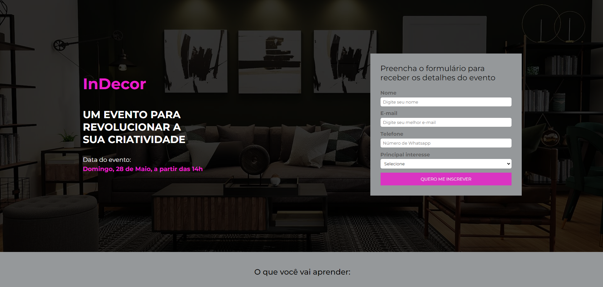

<h3 align = "center" fontSize="200px">
  Landing Page com Responsividade
</h3>

  

## :rocket: Tecnologias

- [Html](https://developer.mozilla.org/pt-BR/docs/Web/HTML/Element/html/)  
- [CSS](https://developer.mozilla.org/pt-BR/docs/Web/CSS)  
- [JavaScript](https://developer.mozilla.org/pt-BR/docs/Web/JavaScript) 

## 💻 Projeto

Projeto feito junto com o professor [ Matheus Battisti](https://github.com/matheusbattisti) do canal [Hora de codar](https://www.youtube.com/c/MatheusBattisti), feito com intutito de aprendizagem e melhorar o uso do html, css. Mantendo a responsividade
em resolucões diferentes.

  

